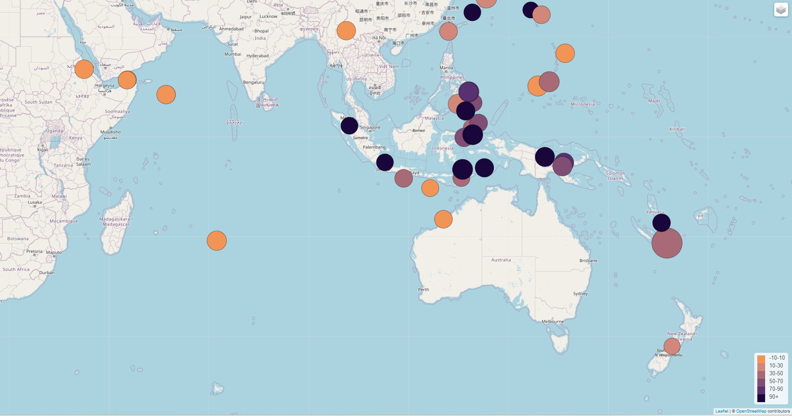

# Where have earthquakes occurred in the last 7 days?

 ### **Overview**
The United States Geological Survey (USGS) provides scientific data about natural hazards, the health of our ecosystems and environment, and the impacts of climate and land-use change.

This visualisation used leaflet to show all earthquakes which occured in the last seven days from USGS.  Data source:
https://earthquake.usgs.gov/earthquakes/feed/v1.0/geojson.php

Aspects to note:
 - Connected to geojson API using D3
 - Marker size was varied based on earthquake magnitude
 - Each point has a tooltip containing additional information
 - The legend on the map shows the depth of the earthquake and their corresponding  colour.

### **Visualisation**
Below is an image of the map that was created.  
 

------------------------------------------------------------------------

### **Contact:**
Email: kymcoleman@gmail.com

------------------------------------------------------------------------
 

Folder structure

-The folder **Leaflet-Part-1 / static / js** contains:
 - '**logic.js**' - the code for the map.
 - '**config.js**' - the url used.

 -The folder **Leaflet-Part-1 / static / css** contains:
 - '**style.css**' - updated to include the legend.
